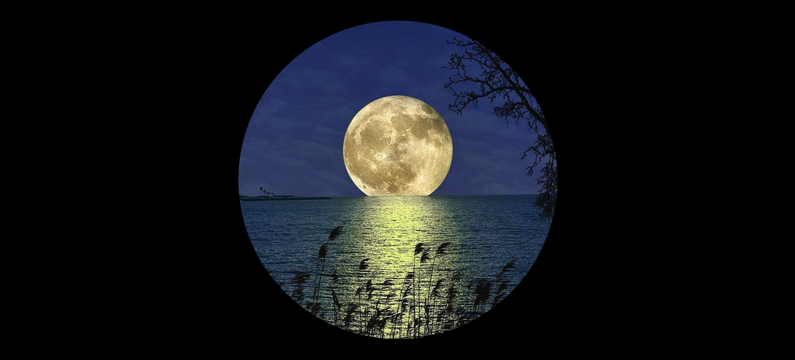
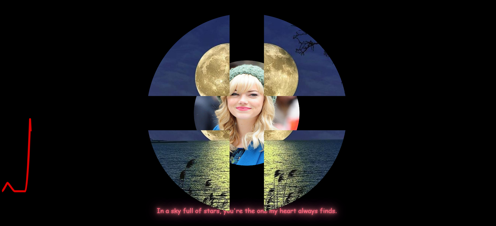
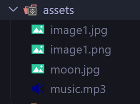

# 🌕 Hover on The Moon to See the Real Moooooon!





A fun, interactive experience where hovering over the moon reveals the _real_ moon 🌝 — complete with background music and custom hover messages!

---

[Live : https://arundada9000.github.io/Moon/](https://arundada9000.github.io/Moon/)

## 🎵 Touch the Screen to Start Music

When you touch or click anywhere on the screen, music will start playing as you hover over the moon.  
Enjoy the relaxing vibe and watch the magic happen ✨

---

## 🛠️ How to Customize It

### 🖼️ Change the Image


1. Go inside the `assets` folder.
2. Paste your new image file there.
3. Delete the existing **`image1.jpg`** file.
4. Rename your new image to **`image1.jpg`**.

✅ Done! Your new image will now appear when hovering over the moon.

---

### 🎧 Change the Music



1. Paste your music file inside the `assets` folder.
2. Delete the existing **`music.mp3`** file.
3. Rename your new file to **`music.mp3`**.

🎶 That’s it! Your chosen music will now play when interacting with the moon.

---

### 💬 Update Hover Text


At the bottom of the `index.html` file, find this code inside the `<script>` tag:

```js
const phrases = ["", ""];
```

You can:

- Replace the text inside the quotes with your own lines.

- Add more phrases by separating them with commas.

- Or remove lines if you want fewer hover messages.

### 🪶 Example:

```js
const phrases = ["To the moon 🚀", "Shine bright 🌕", "Keep dreaming 💫"];
```

### 🌐 Connect with Me

I'm always open to collaborating on interesting projects or just chatting about tech!
Feel free to reach out through any of the platforms below:

[](mailto:arunneupane0000@gmail.com)
[](https://youtube.com/@code_with_ease)
[](https://instagram.com/arundada9000)
[](https://facebook.com/arundada9000) [](https://github.com/arundada9000)

_Made with ❤️ and a bit of moonlight
I couldn’t send it to her, I hope you can 😁😁_

Made By **Arun Neupane**
**For educational purpose** on **code_with_ease** youtube channel.

I hereby declare anybody can use this code to their liking, but i donot give any permission over images , music or names used in this code so keep that in mind.
